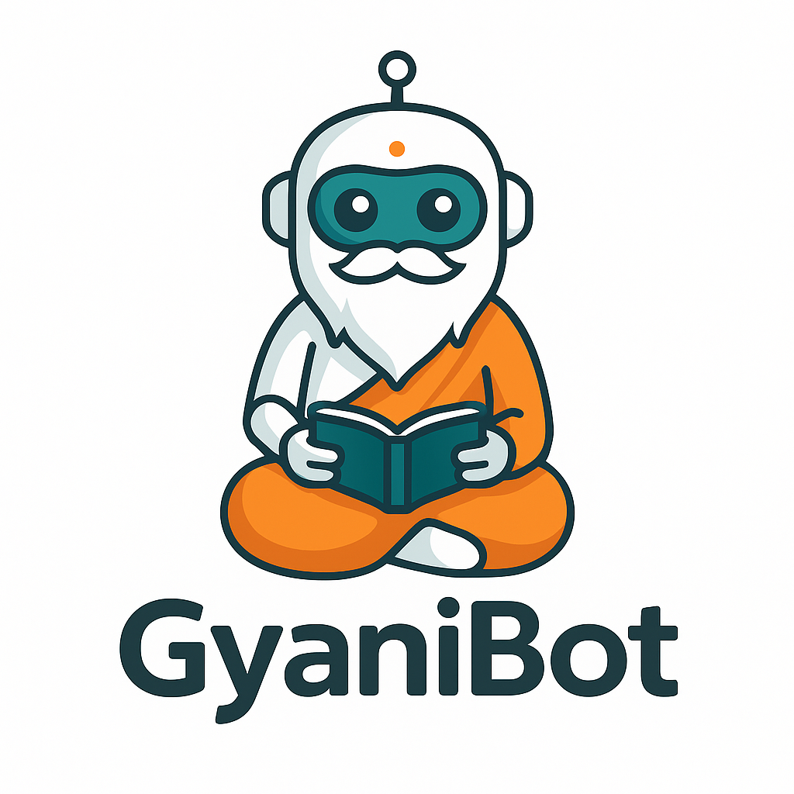

<h1 align="center">Hi 👋, I'm Varun</h1>
<h3 align="center">Java Backend Developer | Spring Boot Enthusiast | Cloud Native</h3>

  

  

---

### Table of Contents

- [About Me](#-about-me)
- [Open To](#-open-to)
- [Tech Stack](#-tech-stack)
- [Featured Projects](#-featured-projects)
- [GitHub Stats](#-github-stats)
- [GitHub Trophies](#-github-trophies)
- [Let's Connect](#-lets-connect)

---

### 👨‍💻 About Me

- 💻 3+ years of experience building backend services in the Java ecosystem
- ⚙️ Specialized in **Spring Boot**, **Hibernate**, **JPA**, and **MySQL**
- 🔒 Focused on secure APIs with **JWT** and role-based access
- ☁️ Deploying containerized applications with **Docker** on **Google Cloud Run**
- 📦 Comfortable designing **microservice architectures**
- 🔧 Advocate for clean code using DTOs and layered design
- 📨 Reach me at [cnsvarun@gmail.com](mailto:cnsvarun@gmail.com)

---

### 🔍 Open To

- ✅ Java Backend Developer roles
- ✅ Spring Boot based API development
- ✅ Projects involving Docker, SQL, and scalable backend architecture
- ✅ Remote, hybrid, or on-site roles

---

### 🛠️ Tech Stack

`Java 21` • `Spring Boot` • `Spring Security` • `Hibernate` • `JPA` • `MySQL`  
`REST APIs` • `JWT Auth` • `Google Cloud Run` • `Cloud SQL` • `Docker` • `RabbitMQ`  
`Swagger` • `Postman` • `GitHub` • `IntelliJ`

---

### 📦 Featured Projects

#### 🤖 GyaniBot

  

- AI-powered chatbot for instant answers and helpful tips
- Built using `Spring Boot` and the `Telegram Bot API`
- 📌 [github.com/varuncns/gyanibot](https://github.com/varuncns/gyanibot)

#### 🔔 NotifyMe

  

- Real-time notification service delivering alerts through Email, SMS, and Push
- Designed for easy integration and uses **RabbitMQ** for messaging
- 📌 [github.com/varuncns/notifyme](https://github.com/varuncns/notifyme)

#### 🛒 OneCartForEverything

  

- Built with `Spring Boot`, `MySQL`, `JWT`, and DTO-based architecture
- Modules: Products, Cart, Orders, Address, Admin Insights
- Deployed via **Docker** and **Google Cloud Run**
- 📌 [github.com/varuncns/onecartforeverything](https://github.com/varuncns/onecartforeverything)

#### 📚 DSAPrep

- Collection of data structure and algorithm practice problems with solutions
- Ideal for interview preparation in Java
- 📌 [github.com/varuncns/dsaprep](https://github.com/varuncns/dsaprep)

  

---

### 📈 GitHub Stats

  
   
  
   
  

---

### 🏆 GitHub Trophies

  

---

### 📧 Let's Connect

  
  
  

---

> "Quality is never an accident. It is always the result of intelligent effort." – John Ruskin
